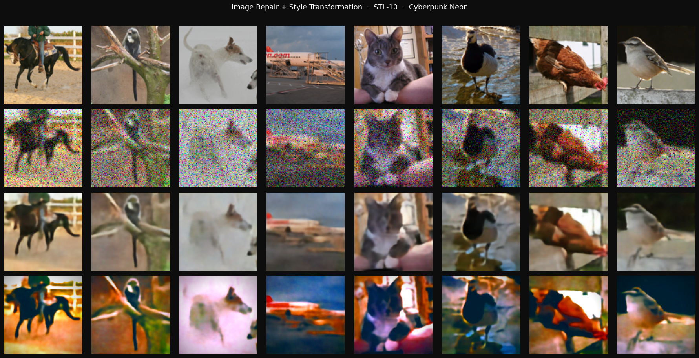
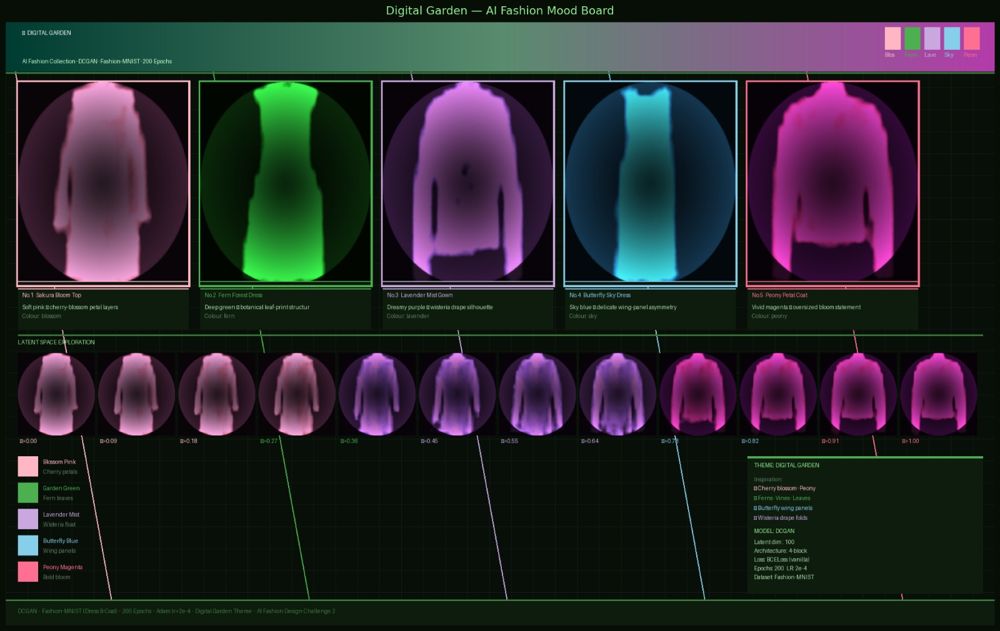
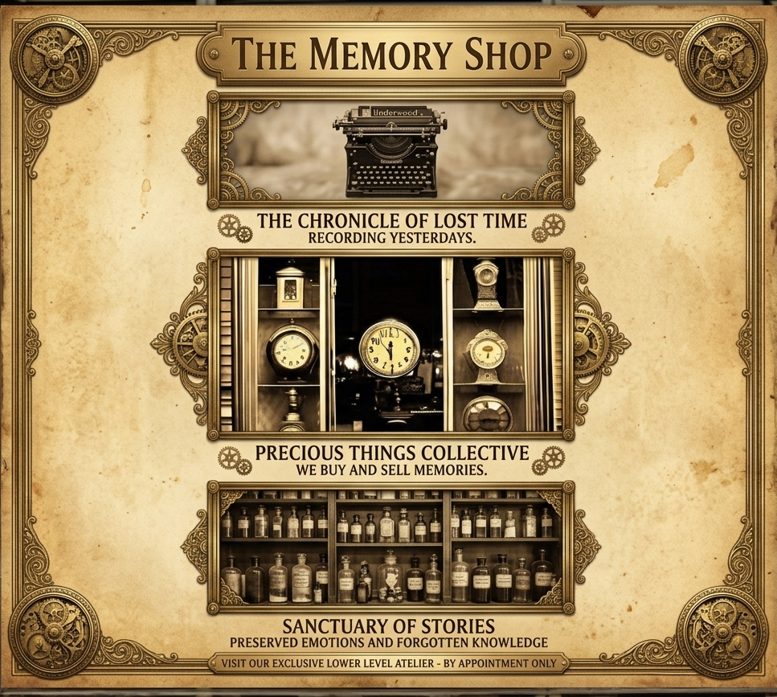

# ACM W GenAI Challenge Team S2
# ✨ ACM-W × Oh Crop! — Generative AI Challenge

> Submissions for the **ACM-W Chapter × Oh Crop! Design Club** Generative AI Challenge.
> Exploring generative AI across technical reconstruction, structured design, and creative storytelling.

---

## 📂 Repository Structure

```
acmw-genai-challenge/
│
├── challenge-1-image-repair/       ← Image degradation + U-Net reconstruction + style transfer
├── challenge-2-fashion-designer/   ← DCGAN-based fashion generation (Digital Garden theme)
├── challenge-3-memory-shop/        ← AI poster design for a fictional memory trading shop
│
└── README.md                       
```

---

## 🗺️ Challenge Overview

| # | Challenge | Type | Theme | Model |
|---|---|---|---|---|
| [1](#-challenge-1-image-repair--style-transformation) | Image Repair + Style Transformation | Core Technical | Multi-stage degradation & reconstruction | U-Net Autoencoder |
| [2](#-challenge-2-ai-fashion-designer) | AI Fashion Designer | Technical Creative | *Digital Garden* botanical collection | DCGAN |
| [3](#-challenge-3-ai-poster-designer) | AI Poster Designer | Core Creative | *Memory Shop* — a fictional memory economy | Generative AI + Design |
---

## 🔧 Challenge 1: Image Repair + Style Transformation

📁 [`challenge-1-image-repair/`](./challenge-1-image-repair/)

A complete image restoration pipeline built on the **STL-10** dataset. Images are degraded through a three-stage process (Gaussian blur, sensor noise, and pixel dropout), then reconstructed using a **U-Net Autoencoder** with skip connections and a combined MSE + L1 loss. The repaired images are then transformed using three hand-crafted style transfer filters.

**Three styles explored:**
- 🖌️ Soft Watercolor Illustration — stacked bilateral filtering with ink-edge overlay
- ⚡ Cyberpunk Neon — S-curve contrast with split cyan/magenta toning
- 🌅 Warm Golden Hour — amber channel shift with shadow lift and vignette

**Key deliverables:** Degraded input · Repaired output · 3 stylized images · Executed notebook

 
---

## 🌿 Challenge 2: AI Fashion Designer

📁 [`challenge-2-fashion-designer/`](./challenge-2-fashion-designer/)

A generative fashion collection trained on **Fashion-MNIST** (Dress + Coat classes) using a **Deep Convolutional GAN (DCGAN)**. The theme — *Digital Garden* — translates botanical references (cherry blossoms, fern fronds, wisteria, butterfly wings, peonies) into wearable silhouettes through custom post-processing color mapping.

**Latent space explored via:**
- 🎲 Sampling — 5 fixed noise vectors → 5 distinct outfit silhouettes
- 〰️ Linear interpolation — 12-step morph from Sakura → Peony

**Key deliverables:** 5 outfit images · Mood board · Latent interpolation strip · Loss plot · Executed notebook


---

## 🧠 Challenge 3: AI Poster Designer

📁 [`challenge-3-memory-shop/`](./challenge-3-memory-shop/)

An AI-assisted poster for *Memory Shop* — a fictional storefront in a near-future world where memories can be bought and sold. Three AI-generated concept visuals were produced, then composited and refined into a single cohesive final poster built around three narrative pillars:

- 📼 **Chronicle of Lost Times** — *Recording Yesterday*
- 💎 **Precious Things Collector** — *We Buy and Sell Memories*
- 🏛️ **Sanctuary of Stories** — *Preserved Emotions and Forgotten Knowledge*

**Key deliverables:** 3 concept images · 1 final poster · `final_poster.png` standalone file · Executed notebook


---

## 🛠️ Tech Stack


**Libraries used across challenges:**
`torch` · `torchvision` · `numpy` · `matplotlib` · `PIL` · `opencv-python` · `scikit-image` · `tqdm`

---
